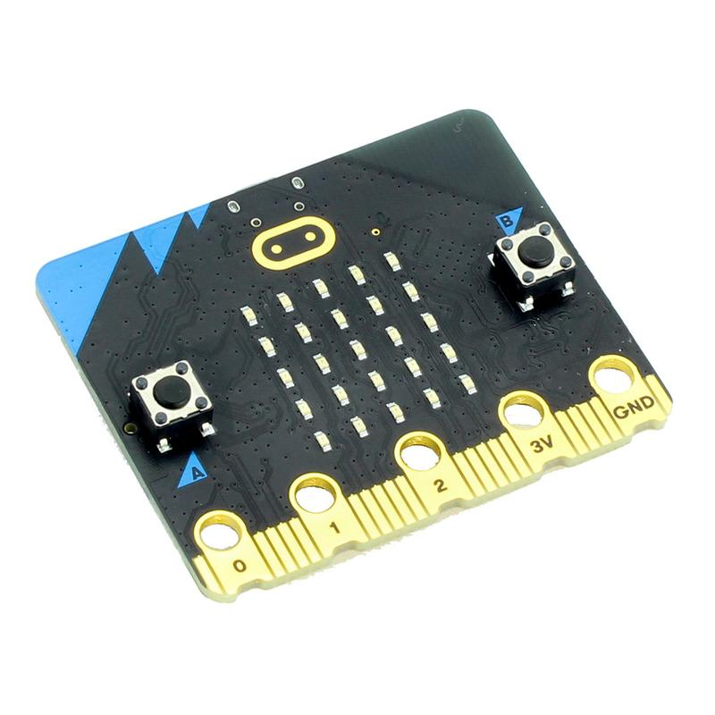

# Rust on Microbit

This repo contains some experiments to run Rust on the [BBC
Micro:bit](https://microbit.org/). Much of the setup is based on the guide
[Embedded Rust setup explained](https://www.youtube.com/watch?v=TOAynddiu5M).
For other resources see below.



## Usage

### Cargo Commands

* `cargo size -- -Ax` - Print size information
* `cargo objdump  -- --disassemble` - Disassemble the binary
* `cargo embed --chip <chip-name>` - Download the binary to the target. Use the
  `probe-rs chip list` command to find all supported chips.

Configuration for the cargo embed command is stored in the `Embed.toml` file.
See [cargo-binutils](https://github.com/rust-embedded/cargo-binutils) for
details.


### Probe rs Commands

* `probe-rs list` - List all connected debug probes
* `probe-rs chip list` - List all connected debug probes
* `probe-rs run --chip-erase` - Erase the chip
* `probe-rs info` - Gets info about the selected debug probe and connected target

## Host Toolchain

### Targets

Use `rustup target add <target-name>` to add support for targets in the build
tool chain. Check the [platform-support](https://doc.rust-lang.org/nightly/rustc/platform-support.html) page for
details.

* Microbit: thumbv7em-none-eabihf

### LLVM Tools and Binutils

Install llvm-tools and cargo-binutils

```
rustup component add llvm-tools
cargo install cargo-binutils
```

Cargo binutils is a wrapper around llvm-tools for better ergonomics.

### Cargo Embed

Cargo embed is now part of probe-rs and is installed using

```
curl --proto '=https' --tlsv1.2 -LsSf https://github.com/probe-rs/probe-rs/releases/latest/download/probe-rs-tools-installer.sh | sh
```

To list attached probes, use the command `probe-rs list`

See documentation at [cargo-embed](https://probe.rs/docs/tools/cargo-embed/)
and [probe-rs](https://probe.rs/).

### RTT

Real-Time Transfer (RTT) I/O protocol. Implements input and output via a debug
probe using in-memory ring buffers and polling.

Target side implementation of the protocol: `https://crates.io/crates/rtt-target`

The implementation requires a platform specific critical section
implementation. For cortex-m, this can be accomplished using the cortex-m crate
optional feature `critical-section-single-core`. Add this using:

`cargo add cortex-m --features critical-section-single-core`

See `https://docs.rs/cortex-m/0.7.7/cortex_m/#critical-section-single-core` for
details.

Enable RTT by adding the following to the `Embed.toml` file:

```
[default.rtt]
enabled = true
```

### GDB

In order to connect to an ARM device using GDB, the `arm-none-eabi-gdb` version
of GDB is needed. For Arch Linux, this is installed using `sudo pacman -S
arm-none-eabi-gdb qemu-system-arm openocd`. It is also possible to use the
gdb-multiarch GDB command if it is available for the host platform. See the
[Rust Embedded
book](https://docs.rust-embedded.org/book/intro/install/linux.html#packages)
for details.

Enable GDB support by adding the below to the `Embed.toml` file. Note that GDB
and RTT cannot be enabled at the same time.

```
[default.gdb]
enabled = true

[default.reset]
halt_afterwards = true
```

Download the binary to the target with the debug probe using `cargo embed` and
then start gdb (using `arm-none-eabi-gdb` or `gdb-multiarch`) in another
terminal, providing the binary. Dump the errors to /dev/null.

```
arm-none-eabi-gdb ./target/thumbv7em-none-eabihf/debug/rust-microbit 2>/dev/null
```

Then connect to the target in gdb and try out some commands.

```
target remote:1337
info registers
disassemble
set print asm-demangle on
monitor reset
```

## PAC

The PAC for the Microbit can be found on the [Crates](https://crates.io/)
page. Search for nrf52833 and select the
[Pac](https://crates.io/crates/nrf52833-pac). Use cargo add to use the crate in
the build.

```
cargo add nrf52833-pac
```

## Documentation

### Hardware

* [Hardware](https://tech.microbit.org/hardware/)
* [Schematics](https://github.com/microbit-foundation/microbit-v2-hardware/blob/main/V2.21/MicroBit_V2.2.1_nRF52820%20schematic.PDF)
* [Datasheet](https://docs.nordicsemi.com/bundle/ps_nrf52833/page/keyfeatures_html5.html)

### Books

* [Rust embedded](https://docs.rust-embedded.org/book/)
* [Microbit](https://docs.rust-embedded.org/discovery/microbit/)
* [Rust Embedded book](https://docs.rust-embedded.org/book/intro/install/linux.html#packages)
